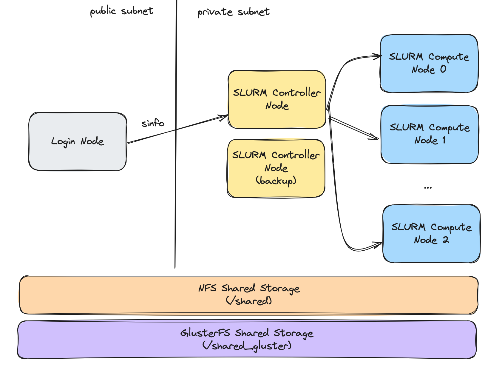

# slurm-on-aws

IaC repository for provisioning a SLURM cluster on AWS EC2 instances.

- **Infrastructure as Code (IaC):** Architected and deployed a production-grade High Performance Computing (HPC) cluster on AWS using **Terraform** and **Ansible**.
- **High-Performance Networking:** Integrated AWS Elastic Fabric Adapter (EFA) with NVIDIA **NCCL** (`aws-ofi-nccl`) to bypass the OS kernel, delivering sub-microsecond latency and 400 Gbps bandwidth for multi-node A100 GPU distributed training.
- **Workload Management & HPC Tuning:** Configured **Slurm** with advanced GPU-aware scheduling (GRES), strict cgroup resource isolation, network topology optimization, and rapid backfill algorithms to maximize cluster throughput.
- **Parallel Filesystems:** Deployed and tuned high-throughput **GlusterFS** and NFS storage clusters with asynchronous I/O and HPC-specific sysctl optimizations.
- **Observability & Accounting:** Established a highly-available accounting pipeline using SlurmDBD backed by AWS RDS (MySQL), and integrated native **NVIDIA DCGM** job profiling via Slurm Prolog/Epilog scripts for granular GPU utilization, memory bandwidth, and power draw metrics.
- **Reliability Engineering:** Developed automated hardware health checks for instantaneous node draining upon detecting PCIe AER faults, XID errors, or EFA link drops to guarantee resilient operational lifetimes for expensive p4d instances.

## Cluster Architecture

| Node Role   | Count | Instance Type  | Notes                                                 |
|-------------|-------|----------------|-------------------------------------------------------|
| Login       | 1     | `t2.small`     | Public subnet, SSH access                             |
| Controller  | 2     | `t2.small`     | 1 primary + 1 backup, lifecycle-protected             |
| CPU Compute | 3     | `t2.small`     | Cluster placement group                               |
| GPU Compute | 2     | `p4d.24xlarge` | 8× A100 GPUs, EFA networking, cluster placement group |
| NFS         | 1     | `t2.small`     | Shared storage, lifecycle-protected                   |
| GlusterFS   | 3     | `t2.small`     | Parallel filesystem with 20 GB EBS each               |
| Database    | 1     | `db.t3.micro`  | RDS MySQL 8.0 for SLURM accounting (module)           |



### Infrastructure Highlights

- **OS**: Ubuntu 24.04 LTS (Noble) on all nodes
- **EBS**: gp3 volumes throughout (better IOPS at lower cost)
- **Networking**: Cluster placement group for compute nodes, EFA-enabled ENIs for GPU nodes (400 Gbps)
- **Security**: IMDSv2 enforced, SSH restricted to login nodes, all-protocol intra-cluster SG
- **Storage**: NFS and GlusterFS with HPC-optimised sysctl, XFS tuning, and async I/O
- **Database**: RDS MySQL 8.0 with gp3 encrypted storage, automated backups, and autoscaling
- **Tagging**: Consistent `Project`, `Environment`, `ManagedBy` tags on all resources

## Provision with Terraform

### Prerequisites

1. Install the `aws` CLI
2. Create an AWS user/profile named `terraform` with `AdministratorAccess`
3. Ensure your service quota covers `p4d.24xlarge` instances (On-Demand P Instances)

### Deploy

```bash
cd cloud-ops

# Copy and customise variables
cp terraform.tfvars.example terraform.tfvars

terraform init
terraform plan    # Review the changeset
terraform apply
```

Useful outputs after apply:

```bash
terraform output login_public_ips
terraform output controller_private_ips
terraform output compute_private_ips
terraform output gpu_compute_private_ips
terraform output slurm_db_endpoint
```

## Ansible

The Ansible inventory (`ansible/inventory.ini`) is **auto-generated** by Terraform after `terraform apply` — all node IPs are populated automatically. No manual IP management needed.

Configure the provisioned hosts and install SLURM & filesystem components:

```bash
cd ansible

# Set hostnames and populate /etc/hosts on all nodes
ansible-playbook -i inventory.ini play-hostnames.yml

# Install and tune NFS server
ansible-playbook -i inventory.ini play-install-nfs.yml

# Install GlusterFS servers, create volumes, and apply tuning
ansible-playbook -i inventory.ini play-install-gluster.yml

# Install NVIDIA drivers
ansible-playbook -i inventory.ini play-install-nvidia-drivers.yml

# Install SLURM
ansible-playbook -i inventory.ini play-install-slurm.yml
```

### Ansible Roles

| Role | Target | Description |
|---|---|---|
| `hostnames` | All nodes | Sets hostname via `hostnamectl` and populates `/etc/hosts` |
| `nfs` | NFS nodes | Installs NFS server with 64 daemon threads, sysctl tuning, async exports |
| `glusterfs` | Gluster nodes | Installs GlusterFS, prepares XFS bricks, probes peers, applies OS tuning |
| `glusterfs_volume` | Gluster nodes | Creates and tunes GlusterFS volumes (reusable, supports multiple volumes) |
| `nvidia_drivers` | GPU nodes | Installs NVIDIA GPU drivers |
| `slurm` | All nodes | Installs and configures SLURM |

## Runbooks

- [Slurm Cluster](docs/runbook-slurm.md) — Node states, job management, accounting, health checks
- [GPU Nodes](docs/runbook-gpu.md) — NVIDIA drivers, DCGM, EFA, NCCL testing
- [NFS Server](docs/runbook-nfs.md) — Logs, diagnostics, common issues, tuning reference
- [GlusterFS](docs/runbook-glusterfs.md) — Cluster status, performance profiling, split-brain recovery

## Submit a SLURM Job

```bash
# Login to the login node
mkdir -p /shared_gluster/date/
mkdir -p /shared_gluster/gpu-sample/

sbatch scripts/sample.slurm
sbatch scripts/gpu-sample.slurm
sbatch scripts/gpu-sample-advanced.slurm
```

## TODO

1. Add CloudWatch alarms for GPU nodes.
2. Configure S3 + DynamoDB backend for remote Terraform state.
