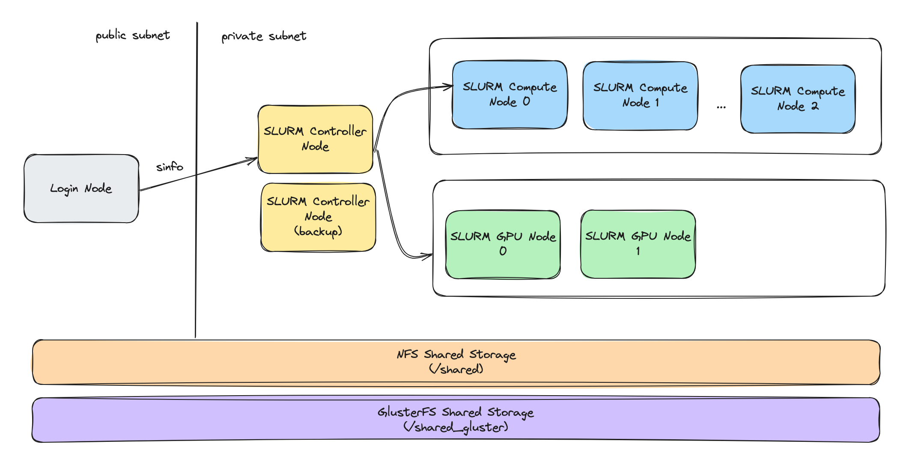

# slurm-on-aws

IaC repository for provisioning a small SLURM cluster on AWS EC2 instances.

* 1 login node to access the SLURM cluster
* 1 Main SLURM controller node and 1 backup SLURM controller node.
* 3 CPU compute nodes
* 2 GPU compute nodes
* 1 NFS node
* 3 GlusterFS nodes



## Provision with Terraform

We can provision the base cloud resources using Terraform:

1. Install `aws` CLI
2. Create an AWS user for `terraform` with `AdministratorAccess` permission
3. Run terraform

```bash
terraform init
terraform apply
```

## Ansible

Next, we need to configure the provisioned hosts and install the necessary SLURM & Filesystem components.


```bash
export LOGIN_NODE_IP=<login-node-ip>

# Update /etc/hosts
ansible-playbook -i inventory.ini play-hostnames.yml

# Install NFS
ansible-playbook -i inventory.ini play-install-nfs.yml

# Install Gluster
ansible-playbook -i inventory.ini play-install-gluster.yml

sudo gluster volume create gv0 replica 3 \
    gluster0:/export/xvdh1/brick \
    gluster1:/export/xvdh1/brick \
    gluster2:/export/xvdh1/brick

sudo gluster volume start gv0
sudo gluster volume status
sudo gluster volume info gv0

# Install NVIDIA drivers
ansible-playbook -i inventory.ini play-install-nvidia-drivers.yml

# Install SLURM
ansible-playbook -i inventory.ini play-install-slurm.yml
```

## Submit a SLURM job

```bash
# Login to the login node
mkdir -p /shared_gluster/date/
mkdir -p /shared_gluster/gpu-sample/

sbatch scripts/sample.slurm
sbatch scripts/gpu-sample.slurm
```

# TODO

1. Provision `slurmdbd` for accounting.

